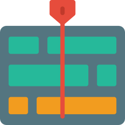
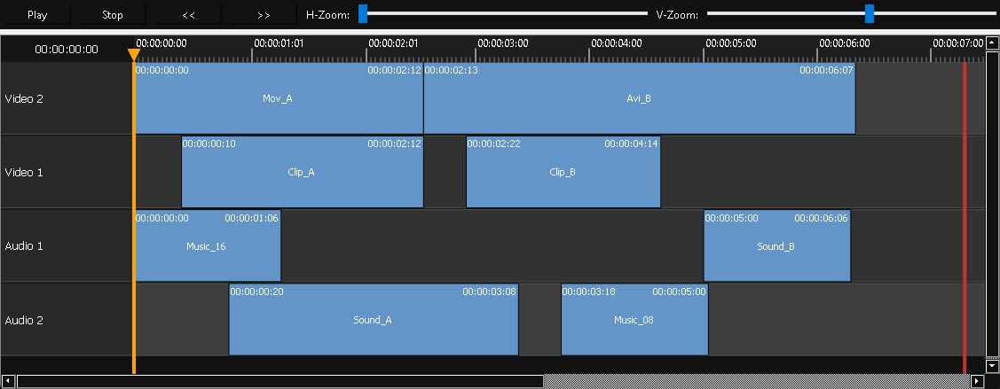

<p align="center">
    
</p>

<h1 align="center">QtEditorialTimelineWidget</h1>

<p align="center">
    
    
    
    
    
    

</p>

### Non linear editor timeline widget for python Qt bindings



## Overview

This widget is designed to display and interact with a timeline containing multiple tracks and clips. All timeline elements (ruler, track headers, track lanes, clips, playhead items, and the end marker) are managed within a single QGraphicsScene to ensure proper alignment and positioning.

## Features

- **Integrated Timeline Elements:**  
  All components (time label, ruler, track headers, track lanes, clips, playhead line, playhead triangle, and end marker) are part of a unified QGraphicsScene.

- **Customizable Theming:**  
  The widget supports configurable themes via a dictionary or a theme name. Two themes are available by default:
  - `dark`
  - `white`

- **Playhead Control:**  
  The playhead is split into two draggable items (a vertical line and a triangle) that update the current time label and allow for precise navigation.

- **Clip Snapping:**  
  Clips can be dragged horizontally (vertical movement is locked) and snap to the edges of adjacent clips with a configurable tolerance.

- **Zoom Functionality:**  
  Horizontal and vertical zoom sliders recalculate positions and sizes (rather than scaling the view), ensuring that text remains crisp.

- **Toolbar Controls:**  
  A top toolbar contains play, stop, frame-back, frame-forward buttons and both horizontal and vertical zoom sliders.

- **End-of-Timeline Marker:**  
  A end-of-timeline marker indicates where the timeline ends. It is constrained to be no earlier than one second after the last clip and can be used to loop playback or stop the timeline.

- **Dark/Light and configurable Themes:**  
  Two default themes and also configurable colors from a theme template


## How to use example:
```python
import sys
app = QApplication(sys.argv)
main_window = QMainWindow()
main_window.setWindowTitle("Editorial Timeline")

# import the module class
from QtEditorialTimelineWidget import TimelineWidget, TrackData, ClipData

# You can pass a theme name ("dark", "light")
# or a complete dictionary of settings.
timelineWidget = TimelineWidget("dark")
main_window.setCentralWidget(timelineWidget)

# Create sample tracks and clips.

trackv2 = TrackData("Video 2")
trackv1 = TrackData("Video 1")

tracka1 = TrackData("Audio 1")
tracka2 = TrackData("Audio 2")

trackv1.add_clip(ClipData("Clip_A", 10, 50))
trackv1.add_clip(ClipData("Clip_B", 70, 40))

tracka2.add_clip(ClipData("Sound_A", 20, 60))
tracka2.add_clip(ClipData("Music_08", 90, 30))

trackv2.add_clip(ClipData("Mov_A", 0, 60))
trackv2.add_clip(ClipData("Avi_B", 61, 90))

tracka1.add_clip(ClipData("Music_16", 0, 30))
tracka1.add_clip(ClipData("Sound_B", 120, 30))

timelineWidget.addTrack(trackv2)
timelineWidget.addTrack(trackv1)
timelineWidget.addTrack(tracka1)
timelineWidget.addTrack(tracka2)

timelineWidget.timeline_view.updateLayout()

main_window.show()
sys.exit(app.exec())
```


## Configuration and Theming
The timeline widget supports theming through a configuration dictionary or a simple theme name. The configuration includes both layout constants and color settings.

Available Themes: `dark` (default) and `light`

Example Usage
To create a timeline widget using the "material-blue" theme:

```python
timelineWidget = TimelineWidget("light")
```
Or pass a complete custom configuration dictionary:

```python
GREENISH_DARK_THEME = {
    # A very dark greenish background for the time label
    "timeLabel_bg": "#0C1A14",
    # White text for high contrast
    "timeLabel_text": "#FFFFFF",
    # Dark green tinted background for the ruler
    "ruler_bg": "#102E1F",        
    # Light green for major tick marks     
    "ruler_tick_major": "#A3D9A5",
    # A medium greenish gray for minor ticks
    "ruler_tick_minor": "#809E81",
    # Bright green playhead for high visibility
    "playhead_color": "#00FF00",
    # Dark green background for track headers
    "track_header_bg": "#163F2A",
    # White text on track headers
    "track_header_text": "#FFFFFF",
    # Dark green lane background for alternate tracks
    "track_lane_bg1": "#1B4E38",
    # Slightly different dark green for alternating lanes
    "track_lane_bg2": "#234F3C",
    # A muted green border for track lanes
    "track_lane_border": "#2F6E54",
    # Green fill for clips   
    "clip_fill": "#2E8B57",
    # Brighter green when clips are selected
    "clip_fill_selected": "#66CDAA",
    # Black border for clips
    "clip_border": "#000000",
    # Lime green end marker
    "end_line_color": "#32CD32",
    # Very dark greenish background for the overall widget
    "background_color": "#0B1E14",
}
timelineWidget = TimelineWidget(GREENISH_DARK_THEME)
```


## License
This project is licensed under the MIT License. 

See the [LICENSE](LICENSE) file for details.

## Attributions
- Logo: <a href="https://www.flaticon.com/free-icons/video-editing" title="video-editing icons">Video editing icons created by Smashicons